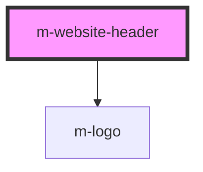

# m-website-header

<!-- Auto Generated Below -->

## Properties

| Property | Attribute | Description | Type     | Default          |
| -------- | --------- | ----------- | -------- | ---------------- |
| `name`   | `name`    |             | `string` | `"Website name"` |
| `to`     | `to`      |             | `string` | `"/"`            |

## Dependencies

### Depends on

- [m-logo](../logo)

### Graph

----------------------------------------------

*Built with [StencilJS](https://stenciljs.com/)*
