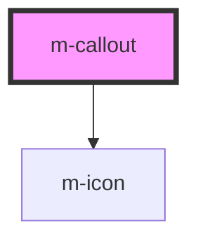

# m-callout

<!-- Auto Generated Below -->

## Properties

| Property      | Attribute     | Description | Type                                          | Default  |
| ------------- | ------------- | ----------- | --------------------------------------------- | -------- |
| `dismissable` | `dismissable` |             | `boolean`                                     | `false`  |
| `icon`        | `icon`        |             | `boolean`                                     | `true`   |
| `subtle`      | `subtle`      |             | `boolean`                                     | `false`  |
| `variant`     | `variant`     |             | `"error" \| "info" \| "success" \| "warning"` | `'info'` |

## Dependencies

### Depends on

- [m-icon](../icon)

### Graph

----------------------------------------------

*Built with [StencilJS](https://stenciljs.com/)*
