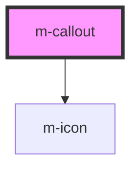

# m-callout

<!-- Auto Generated Below -->

## Properties

| Property      | Attribute     | Description                                                                                                                | Type                                             | Default     |
| ------------- | ------------- | -------------------------------------------------------------------------------------------------------------------------- | ------------------------------------------------ | ----------- |
| `dismissable` | `dismissable` | Makes this dismissable by the user with a button.                                                                          | `boolean`                                        | `false`     |
| `icon`        | `icon`        | Add attribute to show the default icon, or icon name to display one. Consider using `check`, `error`, `warning` or `info`. | `boolean \| string`                              | `undefined` |
| `label`       | `label`       | Adds an attention grabbing label alternative to the visual style. It's highly recommended to include this.                 | `string`                                         | `undefined` |
| `subtle`      | `subtle`      | Makes the element visually less strong by removing the background color.                                                   | `boolean`                                        | `false`     |
| `variant`     | `variant`     | Sets the overall callout visual style, such as colors.                                                                     | `"critical" \| "info" \| "success" \| "warning"` | `'info'`    |

## Dependencies

### Depends on

- [m-icon](../icon)

### Graph

----------------------------------------------

*Built with [StencilJS](https://stenciljs.com/)*
