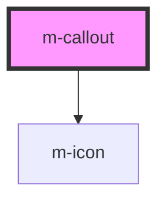

# m-callout

<!-- Auto Generated Below -->

## Properties

| Property      | Attribute     | Description                                                                                                                  | Type                                          | Default  |
| ------------- | ------------- | ---------------------------------------------------------------------------------------------------------------------------- | --------------------------------------------- | -------- |
| `dismissable` | `dismissable` | Makes the element dismissable by the user with a button control.                                                             | `boolean`                                     | `false`  |
| `icon`        | `icon`        | Set to `false` to remove the icon.                                                                                           | `boolean`                                     | `true`   |
| `subtle`      | `subtle`      | Makes the element visually less strong by removing the background color.                                                     | `boolean`                                     | `false`  |
| `variant`     | `variant`     | Select the overall callout intent, colors, and corresponding hidden label that is the alternative text for the visual style. | `"error" \| "info" \| "success" \| "warning"` | `'info'` |

## Dependencies

### Depends on

- [m-icon](../icon)

### Graph

----------------------------------------------

*Built with [StencilJS](https://stenciljs.com/)*
