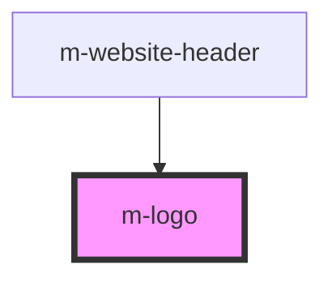

# m-logo

<!-- Auto Generated Below -->

## Properties

| Property  | Attribute | Description                                                     | Type     | Default     |
| --------- | --------- | --------------------------------------------------------------- | -------- | ----------- |
| `variant` | `variant` | Select the Website Header variant.  Options:   - light   - dark | `string` | `undefined` |

## Dependencies

### Used by

 - [m-website-header](../website-header)

### Graph

----------------------------------------------

*Built with [StencilJS](https://stenciljs.com/)*
