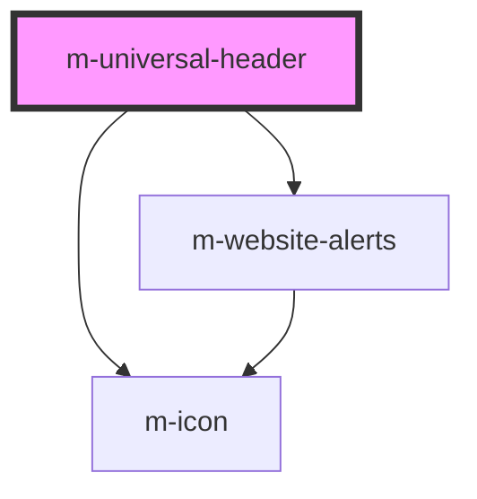

# m-universal-header

<!-- Auto Generated Below -->

## Dependencies

### Depends on

- [m-icon](../icon)
- [m-website-alerts](../website-alerts)

### Graph

----------------------------------------------

*Built with [StencilJS](https://stenciljs.com/)*
